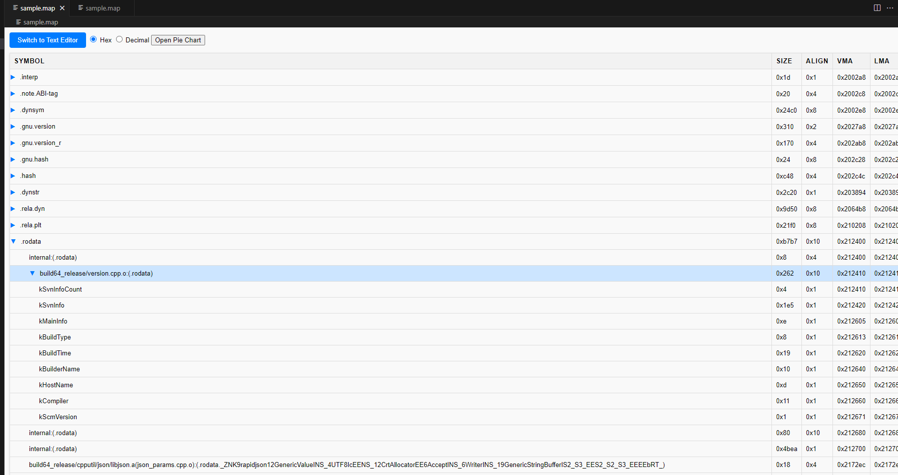

# lld-map-viewer

lld-map-viewer is a Visual Studio Code extension that provides a comprehensive tree table view of your Linker Language Data (LLD) map files. Easily navigate through symbols and their associated attributes, and switch between hexadecimal and decimal number formats to suit your preferences.

## Features

- **Tree Table View**: Visualize your LLD map files in an organized tree table format, allowing for easy navigation and inspection of symbols and their properties.
- **Number Format Switching**: Seamlessly switch between hexadecimal and decimal formats for number fields to enhance readability and analysis.
- **Interactive Interface**: Expand and collapse tree nodes to focus on specific sections of your map files.
- **Pie Chart Visualization**: (Upcoming) Visualize data distributions with pie charts directly within the extension.

## Requirements

- **Visual Studio Code**: Make sure you have [Visual Studio Code](https://code.visualstudio.com/) installed.
- **Node.js**: Required for extension development and dependencies.

## Extension Settings

This extension does not introduce any new settings. However, it leverages existing VS Code settings to enhance functionality.

## Known Issues

- **Performance with Large Files**: Handling extremely large LLD map files may lead to performance degradation. Optimizations are in progress to address this.
- **Pie Chart Rendering**: The pie chart feature is currently under development and may not render accurately for complex data sets.

## Release Notes

### 1.0.0

Initial release of lld-map-viewer with tree table view and number format switching capabilities.

### 1.1.0

- Added support for hexadecimal and decimal number format switching.
- Improved tree table performance and responsiveness.

### 1.2.0

- Fix empty symbol showing problem.
